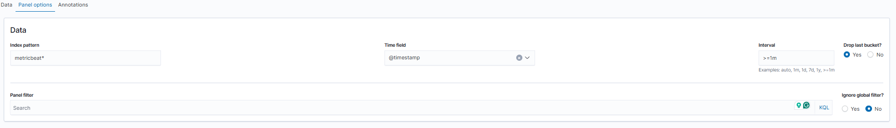
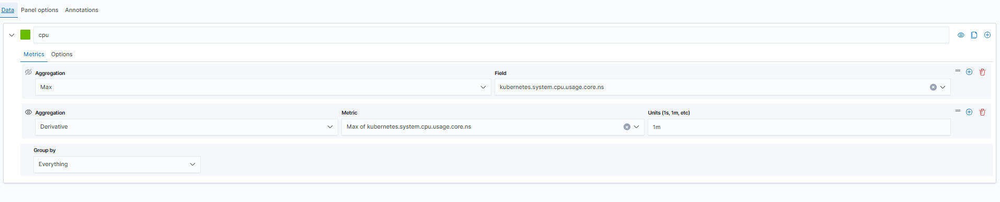
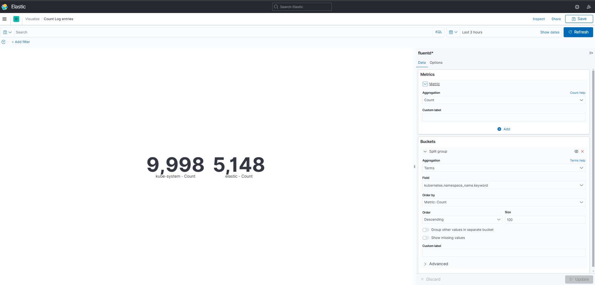
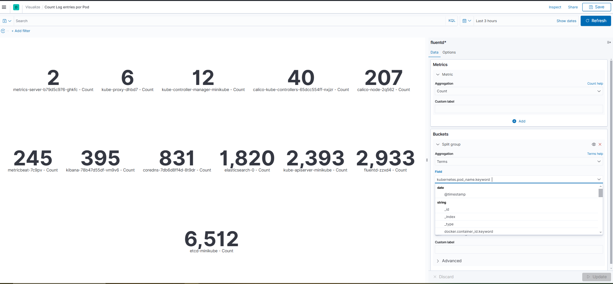
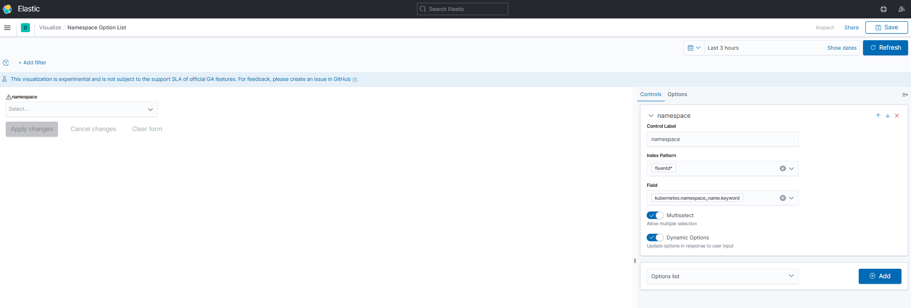
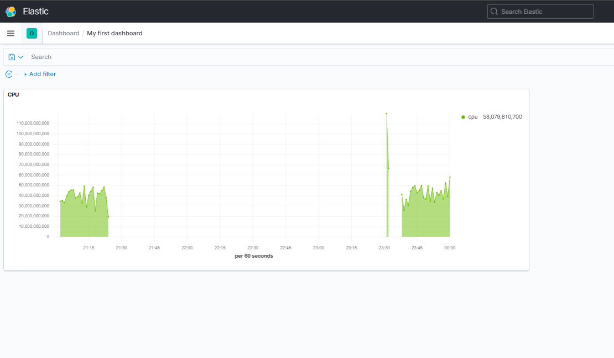
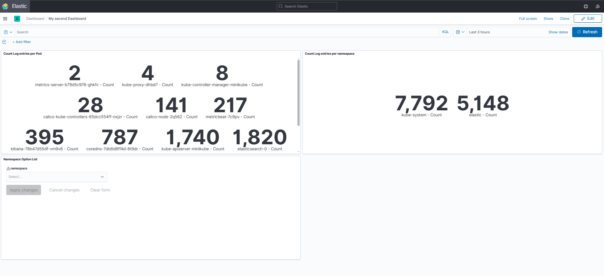

# Laboratorio de Monitoreo y Análisis de Logs en Kubernetes

## Introducción
Este laboratorio tiene como objetivo configurar un entorno de monitoreo y análisis de logs utilizando el stack EFK (Elasticsearch, Fluentd, Kibana) en un clúster de Minikube. Además, se utilizará Metricbeat para la recolección de métricas del clúster.

### Descripción de Componentes
- **Service Metrics**: Proporciona métricas sobre los servicios en el clúster de Kubernetes, permitiendo a los administradores monitorear el rendimiento y el estado de los servicios.
  
- **Kube-state-metrics**: Genera métricas sobre el estado de los objetos de Kubernetes (como pods, deployments, etc.), proporcionando visibilidad sobre la salud y el estado de los recursos del clúster.

- **Elasticsearch**: Almacena y busca datos de logs de manera eficiente. Permite realizar análisis en tiempo real y almacenar grandes volúmenes de datos. Es el motor de búsqueda y análisis encargado de almacenar y analizar los logs.

- **Fluentd**: Un colector de logs que envía datos a Elasticsearch. Facilita la recopilación y transformación de logs desde múltiples fuentes.

- **Kibana**: Una interfaz gráfica para visualizar y analizar los datos almacenados en Elasticsearch. Permite crear dashboards y visualizaciones personalizadas.

- **Metricbeat**: Es un agente ligero que recopila métricas de los nodos y las aplicaciones en Kubernetes y las envía a Elasticsearch para su análisis.

## Requisitos Previos
- Minikube instalado.
- Helm instalado.
- Kubernetes configurado.

## Paso 1: Instalación de Service Metrics y Kube-state-metrics con Helm

### Instalación

1. **Instalar `metrics-server`**:
   ```bash
   helm repo add metrics-server https://kubernetes-sigs.github.io/metrics-server/
   helm install metrics-server metrics-server/metrics-server
   ```

2. **Instalar `kube-state-metrics`**:
   ```bash
   helm repo add kube-state-metrics https://kubernetes.github.io/kube-state-metrics
   helm install kube-state-metrics kube-state-metrics/kube-state-metrics
   ```

Verifica que los pods estén corriendo:
```bash
kubectl get pods -n kube-system
```

## Paso 2: Instalación de la Aplicación Flask con Helm

### Instalación

Instala la aplicación Flask en el namespace `elastic` con Helm:

   ```bash
   helm install flask-web ./FLASK-WEB-APP -f ./FLASK-WEB-APP/valuesServiceA.yaml -n elastic
   ```

### Verificación
Verifica que la instalación se haya realizado correctamente:
```bash
kubectl get pods -n elastic
```

## Paso 3: Instalación Declarativa del Stack EFK

### Crear Namespace
Crea un namespace por el Stack EFK:
```bash
kubectl create namespace elastic
```

### Instalaciones
1. **Instalar Elasticsearch**:

   Aplica el manifiesto `elasticsearch-statefulset.yaml`:
   ```bash
   kubectl apply -f elasticsearch-statefulset.yaml
   ```

2. **Instalar Fluentd**:

   Aplica el manifiesto `fluentd-daemonset.yaml`:
   ```bash
   kubectl apply -f fluentd-daemonset.yaml
   ```

3. **Instalar Kibana**:

   Aplica el manifiesto `kibana-deployment.yaml`:
   ```bash
   kubectl apply -f kibana-deployment.yaml
   ```

### Verificación

Verifica que las instalaciones se hayan realizado correctamente:
```bash
kubectl get pods -n elastic
```

## Paso 4: Instalación Declarativa de Metricbeat

### Instalación

Instala Metricbeat en el namespace kube-system:
Aplica el manifiesto `metricbeat-daemonset.yaml`:
   ```bash
   kubectl apply -f metricbeat-daemonset.yaml
   ```

### Verificación
Verifica que la instalación se haya realizado correctamente:
```bash
kubectl get pods -n kube-system
```

## Paso 5: Conexión a Kibana

### Habilitar Port Forwarding
Habilita el port-forwarding para acceder a Kibana:
```bash
kubectl port-forward service/kibana 5601:5601 -n elastic
```

### Acceder a Kibana
Abre un navegador y dirígete a: [http://localhost:5601](http://localhost:5601)

## Paso 6: Configuración de Index Patterns en Kibana

1. Desde el menú principal en la parte superior izquierda, dirígete a **Stack Management** en Kibana.
2. En **Kibana/Index Patterns**, crea dos index patterns:
   - `fluentd*`
   - `metricbeat*`

## Paso 6: Visualización y Dashboard en Kibana

### Logs Discovery
1. En el menú principal, ve a **Discover**.
2. Agrega un filtro para `kubernetes.pod_name` igual a `<nombre del pod aplicación Flask>`. Desplegado en el paso 2.
4. Para ver más logs, abre un port-forwarding al servidor Flask:

   ```bash
   kubectl port-forward svc/flask 5000:5000 -n elastic
   ```

5. Realiza unas solicitudes HTTP al servidor Flask y verifica en Kibana cómo los logs se registran automáticamente.

### Visualizaciones
1. Crea una visualización de tipo **TSVB**:
   - En el menú principal, sección Kibana, selecciona **Visualize**.
   - Escoge **TSVB** y configura los datos.

   

   

   - Dale un nombre y guárdala.

2. Crea una visualización de tipo **Metric**:
   - En el menú principal, sección Kibana, selecciona **Visualize**.
   - Escoge **Metric** y configura los datos.

   

   - Dale un nombre y guárdala.

3. Crea una visualización de tipo **Metric**:
   - En el menú principal, sección Kibana, selecciona **Visualize**.
   - Escoge **Metric** y configura los datos.
   
   

   - Dale un nombre y guárdala.

4. Crea una visualización de tipo **Controls**:
   - En el menú principal, sección Kibana, selecciona **Visualize**.
   - Escoge **Controls** y configura los datos.
   
   

   - Dale un nombre y guárdala.

### Crear Dashboard
1. Ve a la sección **Dashboards** en Kibana.
2. Agrega las visualizaciones creadas anteriormente para crear los siguientes dos dashboards: 




3. Dale un nombre al dashboard y guárdalo.

## Conclusión
Con estos pasos, has configurado un entorno completo de monitoreo y análisis de logs en Kubernetes utilizando el stack EFK y Metricbeat. Ahora puedes monitorear el rendimiento de tus aplicaciones y analizar los logs generados en el clúster.

## Recursos Adicionales
- [Documentación de Elasticsearch](https://www.elastic.co/guide/en/elasticsearch/reference/current/index.html)
- [Documentación de Fluentd](https://www.fluentd.org/docs/)
- [Documentación de Kibana](https://www.elastic.co/guide/en/kibana/current/index.html)
- [Documentación de Metricbeat](https://www.elastic.co/guide/en/beats/metricbeat/current/index.html)
```